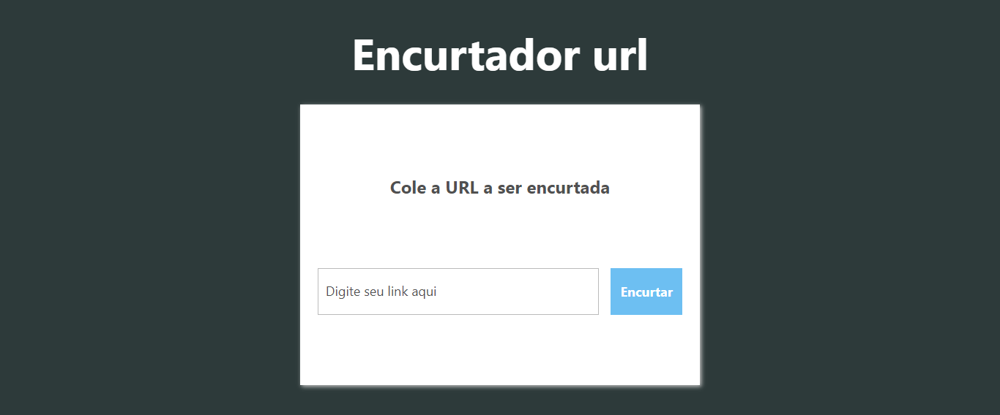
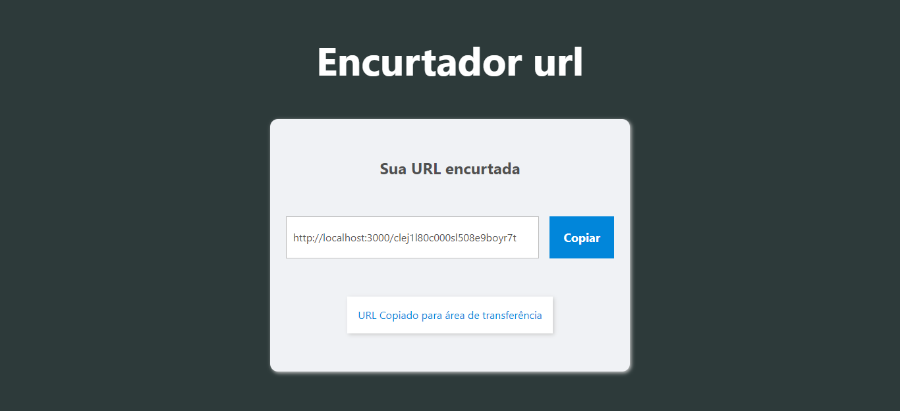

<h1 align="center">
  
</h1>

  <a href="#-tecnologias">Tecnologias</a>&nbsp;&nbsp;&nbsp;|&nbsp;&nbsp;&nbsp;
  <a href="#-projeto">Projeto</a>&nbsp;&nbsp;&nbsp;|&nbsp;&nbsp;&nbsp;
  <a href="#-layout">Layout</a>&nbsp;&nbsp;&nbsp;|&nbsp;&nbsp;&nbsp;
  <a href="#memo-licença">Licença</a>

 

  

 

  

  

## 🚀 Tecnologias

Esse projeto foi desenvolvido com as seguintes tecnologias:

# Front-end

- Next Js
- Tailwind
- tRPC Client
- Typescript

# Back-end

- tRPC Server
- Prisma
- MySQL
- PlanetScale
- Zod

## 💻 Projeto

O "Encurtador URL" é um site que permite que o usuário encurte seus links longos em uma URL mais curta e fácil de ser compartilhada. Ao cadastrar um link no site, é gerada uma nova URL que redireciona o usuário para a página original. Essa ferramenta é útil para compartilhar links em redes sociais, e-mails ou mensagens instantâneas sem ocupar muito espaço e gerar confusão para o usuário final.

## 🔖 Layout

Você pode visualizar o projeto através [desse link](https://url-shortener-orpin-iota.vercel.app/).

## :memo: Licença

Esse projeto está sob a licença MIT. Veja o arquivo [LICENSE](LICENSE.md) para mais detalhes.
